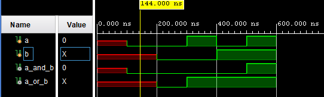

# Tutorial 01 - Verilog Basics

Created November 2021

## Simulation Language

[Verilog](https://en.wikipedia.org/wiki/Verilog) started out (~1983) as a proprietary tool for simulating
digital logic. In 1995 it was given to the IEEE for standardisation. It went through several revisions
including 1995, 2001 and 2005. Verilog was merged into SystemVerilog in 2009. Despite this support for
Verilog remains strong.

At some point (todo - 1990?) the Verilog language started being used for synthesis i.e. the process of
converting a hardware description into an FPGA program or an ASIC mask. Only a subset of Verilog can
be synthesised e.g. system tasks and delays are not synthesisable.

### Logic levels

Verilog has 4 distinct logic values:
1. 0
2. 1
3. X - unknown
4. Z - high impedance, tri-state output, treated as X for inputs

Why? Because it started out as a simulation language and there needed to be a value for unknown.
The X value doesn't exist in real, synthesised hardware, an input left disconnected will normally float
high or low (or be tied). A synthesised gate will *never* output an X. The differences between
simulation and synthesis value can be subtle but they can cause issues during design validation.

### Logic Levels - Example01

At this point it is recommended that you examine and run [example01_tb.v](testbench/example01_tb.v).
It simulates parallel AND/OR gates connected to the same pair of inputs. Running the simulation in
Vivado produces: 

## Overview

Hierarchical design structure
Chip analogy

Module structure
Module instantiation

Case sensitivity
C language
concurrency

Gate Level
Data Flow
Behavioural

Reg vs Wire
