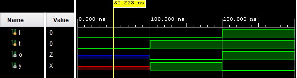

# Tutorial 01 - Verilog Basics

Created November 2021

## Simulation Language

[Verilog](https://en.wikipedia.org/wiki/Verilog) started out (~1983) as a proprietary tool for simulating
digital logic. In 1995 it was given to the IEEE for standardisation. It went through several revisions
including 1995, 2001 and 2005. Verilog was merged into SystemVerilog in 2009. Despite this support for
Verilog remains strong.

At some point (todo - 1990?) the Verilog language started being used for synthesis i.e. the process of
converting a hardware description into an FPGA program or an ASIC mask. Only a subset of Verilog can
be synthesised e.g. system tasks and delays are not synthesisable.

### Logic levels

Verilog has 4 distinct logic values:
1. 0
2. 1
3. X - unknown
4. Z - high impedance, tri-state output, treated as X for inputs

Why? Because it started out as a simulation language and there needed to be a value for unknown.
The X value doesn't exist in real, synthesised hardware, an input left disconnected will normally float
high or low (or be tied). A synthesised gate will *never* output an X. The differences between
simulation and synthesis value can be subtle but they can cause issues during design validation.

### Logic Levels - Example01

At this point it is recommended that you examine and run [example01_tb.v](testbench/example01_tb.v).
It simulates parallel AND/OR gates connected to the same pair of inputs. Running the simulation in
Vivado produces:


The simulation runs through a series of steps 100ns apart. In the first interval, 0-100ns, the
inputs a and b are undefined. Because the inputs are unknown the simulator sets the outputs to
unknown. Those are the four red lines at the start of the graph.

At time=100ns input a is assigned the value 0. It is no longer undefined and this allows the
simulation to update its output values. You can see that **a_and_b** has the value 0, **a_or_b** remains
undefined. Why one and not both?

It turns out that the truth tables for AND and OR work a little differently with four logic levels.

#### AND

|   |     |   | b |     |
|---|-----|---|---|-----|
|   |     | 0 | 1 | X/Z |
|   | 0   | 0 | 0 |  0  |
| a | 1   | 0 | 1 |  X  |
|   | X/Z | 0 | X |  X  |

It turns out that 0 AND X is 0, whereas 1 AND X is X. Logically 0 and anything is always 0.
The can not be said for 1 and anything. 1 AND 0 is 0, 1 AND 1 is 1 but with 1 AND X the
result remains undefined.

Different but logical when you think about it.

#### OR

|   |     |   | b |     |
|---|-----|---|---|-----|
|   |     | 0 | 1 | X/Z |
|   | 0   | 0 | 1 |  X  |
| a | 1   | 1 | 1 |  1  |
|   | X/Z | X | 1 |  X  |

The OR truth table is a little different. Note that 1 OR X is 1 but 0 OR X is undefined. With an
OR gate if one of the inputs is a 1 it doesn't matter what value the other input has. For 0 OR
X the result is undefined.

The extended truth tables explain why **a_and_b** has a value in the second interval and
**a_or_b** remains undefined.

What would change if the first value assigned to **a** was a 1 instead of a 0?

### Logic Levels - Example02

The fourth logic level, Z, is used to represent the high impedence state aka tri-state aka
disconnected output. With an FPGA it can be used in simulation and synthesis but there are
synthesis restrictions.

With synthesis it can only be used with output signals at the top level i.e. those that leave
the chip. High impedance signals are not available inside the FPGA itself.

The general syntax for creating a high impedance output is:
```
assign <output> = <control> ? <input> : 1'bz;
```

The way to read this is *if `<control>` is true then `<output>` is assigned the `<input>` value
else (:) the `<output>` goes to Z (high impedance)*.

[example02_tb.v](testbench/example02_tb.v) simulates a high impedance output being fed into an inverter.
The purpose of the inverter is to show what happens when a Z value appears on an input i.e. treated
the same as an undefined value. The simulation output is this:



In the first interval (0-100ns) the input *i* and control *t* are both 0. This results in
the output *o* going high impedance Z, represented by the blue line. The inverter output
*y* is undefined because its input is set to Z (also undefined).

In later intervals (100-300ns) the control input *t* has been set to 1 and output *o*
follows its input *i* values.

## Language Structure

Verilog designs are modular and hierarchical. Every design will have a single top-level module.
The top module may instantiate other modules and so on. A large design may be several levels
deep. This is analogous to actual hardware design where a system, say a PC (top level), will
have nested modules (motherboard, power supply). The nested modules (motherboard) will be
composed from LSI chips, DRAM modules etc.

### Module Syntax

The general syntax for a module definition looks like this:

```
module <module_name>
    #(parameter_declaration,parameter_declaration,... )
    (port_declaration port_name, port_name,...,
     port_declaration port_name, port_name,...);
     
     module items

endmodule
```

Verilog modules are stored in files. The file name follows the module name e.g. `module
top` would be in file `top.v`.

The syntax for module definitions has changed between versions. The Verilog-2001 standard
ANSI-C style as shown here. It is the most recent and more compact way of defining the ports.
Older articles and text books may differ i.e. use the older styles.

#### Loopback Example

A trivial example would be to loopback a modules inputs to its outputs:

```
module loopback(
    input        clk,  // 50 MHz
    input  [3:0] sw,   // 4 slide switches
    output [3:0] led   // 4 LEDS
    );
    
    assign led = sw;

endmodule
```

The port declaration defines three nets, clk (input scalar), sw (input vector) and led
(output vector). More on this later.

The `assign` statement connects the two busses together with `sw[3]` being connected
to `led3]`.

The example shown can be synthesised i.e. programmed into hardware by following the
manufacturers suggested workflow.


Verilog defines *scalars* as being 1-bit values. *Vectors* are synonymous
with busses. In the above example `sw` and `led` are both 4-bit wide vectors where the
MSB is bit 3 and the LSB is bit 0.

#### Case Sensitivity

Verilog is derived from the C language. Like C, Verilog is case sensitive. In the loopback
example above lower case has been used for input/output vector names `sw` and `led`.
Note that changing the `assign LED = sw` statement would result in an error. `LED` is
treated as a separate network to `led`.

### Module instantiation

concurrency

Gate Level
Data Flow
Behavioural

Reg vs Wire

## Bibliography

1. [Sutherland, S. Verilog HDL Quick Reference Guide](https://sutherland-hdl.com/pdfs/verilog_2001_ref_guide.pdf)
